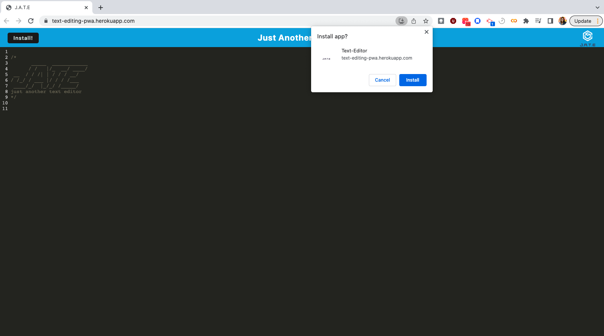

# Text-Editing-Progressive-Web-Application

## Description 

This project is a demonstration of a single page application which meets Progressive Web Application criteria. This app is capable of running offline just as well as online. This project began with an existing application which was implimented with an IndexedDB database. With this application, I learned about the capabilities of a module-compatible system with the webpack plugin. I also learned how to use idb, a lightweight wrapper around the IndexedDB API. The application also uses bebel in order to use async/await within the application. The most challenging aspect of this project was that working with module-compatible systems was very new to me. The coolest aspect of this project was being able to download an application and seeing it render as an idcon on my desktop. Having a registered service worker using workbox allowed me to have my static assets pre cached. 

## Installation 

To access this application, go to the link below to where the web application is deployed to using Heroku. 

## Usage 

When the user accesses the web application. The user is able to use the text editor on the web, if the user loses access to the internet, the user will still be able to use the application and automatically save content. When the user clicks on the Install button either on the window or the browser tab. The user can use the application on thier computer or laptop without internet. 

md!!

## Credits 

The beginning application came from the following repository. 

https://github.com/coding-boot-camp/cautious-meme

references for the code came from the UCLA class repository. 

## License 

MIT License

Copyright (c) [2022] [AlejandraQuintero]

Permission is hereby granted, free of charge, to any person obtaining a copy of this software and associated documentation files (the "Software"), to deal in the Software without restriction, including without limitation the rights to use, copy, modify, merge, publish, distribute, sublicense, and/or sell copies of the Software, and to permit persons to whom the Software is furnished to do so, subject to the following conditions:

The above copyright notice and this permission notice shall be included in all copies or substantial portions of the Software.

THE SOFTWARE IS PROVIDED "AS IS", WITHOUT WARRANTY OF ANY KIND, EXPRESS OR IMPLIED, INCLUDING BUT NOT LIMITED TO THE WARRANTIES OF MERCHANTABILITY, FITNESS FOR A PARTICULAR PURPOSE AND NONINFRINGEMENT. IN NO EVENT SHALL THE AUTHORS OR COPYRIGHT HOLDERS BE LIABLE FOR ANY CLAIM, DAMAGES OR OTHER LIABILITY, WHETHER IN AN ACTION OF CONTRACT, TORT OR OTHERWISE, ARISING FROM, OUT OF OR IN CONNECTION WITH THE SOFTWARE OR THE USE OR OTHER DEALINGS IN THE SOFTWARE.